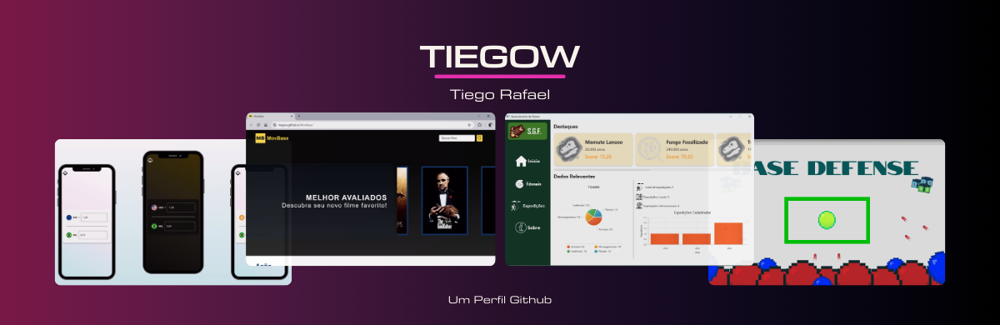

# Olá, sou Tiego! Bem vindo(a) ao meu perfil no Github! 

  

<h2 align="center">Sobre mim</h2>

:mortar_board: - Técnico em eletrônica. Cursando Tecnologia da Informação na UFRN

:book: - Atualmente estou aprendendo sobre desenvolvimento mobile com Flutter

:star2: - Coleciono várias experiências com programação. Veja algumas legais em <a href="https://github.com/Tiegow/MovBase"  target="_blank">MovBase</a>, <a href="https://github.com/Tiegow/ConversorMoeda"  target="_blank">ConversorMoeda</a> ou <a href="https://github.com/Tiegow/Jogo-BaseDefense"  target="_blank">BaseDefense</a>

:telescope: - Disposto a colaborar em atividades e projetos relacionados a desenvolvimento mobile, front-end ou outras experiências instigantes em programação :eyes:

<h2 align="center">Tecnologias e Ferramentas</h2>

    
    
    
    
    
    
    

<h2 align="center">Minhas Stats</h2>

<h2 align="center">Contatos</h2>

    
    
    

